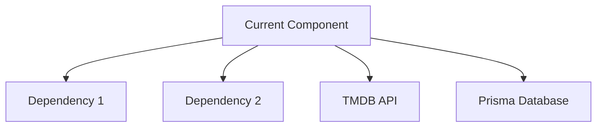

# Create FlickPick GitHub Issue

## Introduction

Transform FlickPick roadmap items into well-structured GitHub issues tailored for multi-agent development. This command extracts context from project documentation, assigns appropriate agents, and ensures alignment with the 6-phase development workflow.

## Prerequisites

- GitHub CLI (`gh`) installed and authenticated
- Access to the FlickPick repository
- Understanding of the roadmap item or feature to document

## Feature Description

<feature_description> #$ARGUMENTS </feature_description>

## Main Tasks

### 1. FlickPick Context Gathering

**Project Documentation Research:**

- [ ] Review `/docs/task-list.md` for phase alignment and deliverables
- [ ] Check `/CLAUDE.md` for technical specifications and architecture
- [ ] Examine `/docs/PRD.md` for product requirements and constraints
- [ ] Review existing codebase structure and patterns
- [ ] Check TMDB API integration requirements
- [ ] Analyze existing issues for FlickPick formatting patterns and labels

**Roadmap Context Analysis:**

- [ ] Identify which development phase (1-6) the issue belongs to:
  - Phase 1: Foundation & Setup (Next.js, Prisma, TMDB API)
  - Phase 2: Core Features (Movie cards, swipe gestures, navigation)
  - Phase 3: Data & Recommendations (Device fingerprinting, algorithms)
  - Phase 4: Polish & Performance (Animations, error handling)
  - Phase 5: Testing & Security (Comprehensive QA, security audit)
  - Phase 6: Deployment & Launch (Production setup, monitoring)
- [ ] Determine lead and support agent assignments
- [ ] Identify Product Owner, Technical Architect, and UI/UX Designer review requirements
- [ ] Check for cross-phase dependencies and coordination needs

**Multi-Agent Coordination Research:**

- [ ] Identify primary agent responsible (lead)
- [ ] Determine supporting agents needed
- [ ] Note required handoff interfaces and deliverables
- [ ] Check for leadership agent approval requirements
- [ ] Document integration points with other agents' work

### 2. Agent Assignment & Coordination Planning

**Primary Agent Identification:**

- [ ] Assign lead agent based on expertise area:
  - `@agent-technical-architect` (System architecture, Next.js setup)
  - `@agent-nextjs-api-developer` (API routes, Prisma, TMDB integration)
  - `@agent-nextjs-ui-builder` (React components, swipe gestures, animations)
  - `@agent-ui-ux-designer` (Design system, accessibility, user experience)
  - `@agent-security-guardian` (Device fingerprinting, API security, privacy)
  - `@agent-testing-qa-engineer` (Unit tests, E2E, performance testing)
  - `@agent-product-owner` (Product strategy, requirements, prioritization)

**Leadership Agent Reviews:**

- [ ] Determine if `@agent-product-owner` approval required
- [ ] Check if `@agent-technical-architect` review needed
- [ ] Identify if `@agent-ui-ux-designer` review required

**Supporting Agent Coordination:**

- [ ] List supporting agents needed for implementation
- [ ] Define handoff requirements and interfaces
- [ ] Document integration testing needs
- [ ] Plan for cross-agent communication

### 3. Choose Implementation Detail Level

#### 📄 ROADMAP QUICK ISSUE

**Best for:** Straightforward roadmap items, single-agent tasks
**Includes:**

- Roadmap context and phase alignment
- Agent assignment and basic coordination
- Essential acceptance criteria
- Tech stack constraints

#### 📋 MULTI-AGENT STANDARD

**Best for:** Most roadmap features requiring agent coordination
**Includes everything from ROADMAP QUICK plus:**

- Detailed agent handoff requirements
- Leadership agent review checkpoints
- Cross-phase dependencies
- Integration testing requirements
- FlickPick architecture alignment

#### 📚 COMPREHENSIVE ROADMAP ISSUE

**Best for:** Major phase milestones, complex multi-agent features
**Includes everything from MULTI-AGENT STANDARD plus:**

- Detailed implementation plan with agent phases
- Complete handoff interface specifications
- Risk mitigation for agent coordination
- Performance benchmarks and success criteria
- Future extensibility within FlickPick context

### 4. FlickPick Issue Creation & Formatting

**Title Format:**

```
[Phase X] Feature Description - @lead-agent
```

Examples:

- `[Phase 1] Next.js 15 Project Setup with Prisma - @agent-technical-architect`
- `[Phase 2] MovieCard Swipe Component Implementation - @agent-nextjs-ui-builder`
- `[Phase 3] TMDB API Integration and Caching - @agent-nextjs-api-developer`

**FlickPick Labels:**

- **Phase Labels**: `phase-1-foundation`, `phase-2-core-features`, `phase-3-data-recommendations`, `phase-4-polish-performance`, `phase-5-testing-security`, `phase-6-deployment-launch`
- **Agent Labels**: `agent-technical-architect`, `agent-nextjs-api-developer`, `agent-nextjs-ui-builder`, `agent-ui-ux-designer`, `agent-security-guardian`, `agent-testing-qa-engineer`, `agent-product-owner`
- **Component Labels**: `tmdb-api`, `prisma-database`, `nextjs-api`, `react-components`, `swipe-gestures`, `voting-system`, `recommendations`, `device-fingerprinting`
- **Priority Labels**: `roadmap-critical`, `roadmap-important`, `roadmap-nice-to-have`
- **Review Labels**: `needs-product-approval`, `needs-architect-review`, `needs-design-review`

**Content Sections:**

- [ ] **Roadmap Context**: Phase, milestone, and deliverable alignment
- [ ] **Agent Assignment**: Primary and supporting agents with responsibilities
- [ ] **Architecture Alignment**: References to relevant docs and patterns
- [ ] **Leadership Reviews**: Required approvals and checkpoints
- [ ] **Handoff Requirements**: Interfaces, tests, and documentation needed
- [ ] **FlickPick Integration**: How this fits with existing components
- [ ] **Success Metrics**: Specific to FlickPick performance targets

### 5. Final Review & Submission

**FlickPick Pre-submission Checklist:**

- [ ] Title includes phase and lead agent assignment
- [ ] Roadmap phase and milestone clearly identified
- [ ] Agent coordination requirements documented
- [ ] Leadership review requirements specified
- [ ] FlickPick architecture references included
- [ ] Integration points with other agents defined
- [ ] Success criteria align with roadmap goals

## FlickPick Issue Templates

### Template: Roadmap Quick Issue

```markdown
## 📋 Roadmap Context

**Phase**: [Phase X - Name]
**Milestone**: [MVP/Beta/v1.0]
**Lead Agent**: @agent-[name]
**Supporting Agents**: @agent-[name], @agent-[name]

## 🎯 Feature Description

[Brief description of the roadmap item]

## 📐 Architecture References

- [ ] `/CLAUDE.md` - [Technical specifications section]
- [ ] `/docs/PRD.md` - [Product requirements section]
- [ ] `/docs/task-list.md` - [Task dependencies and phase alignment]

## ✅ Acceptance Criteria

- [ ] [Specific, testable criterion 1]
- [ ] [Specific, testable criterion 2]
- [ ] [Specific, testable criterion 3]

## 🔗 Agent Handoffs

**Receives from**: @agent-[previous] - [Interface/deliverable]
**Delivers to**: @agent-[next] - [Interface/deliverable]

## 🏆 Success Metrics

- [ ] Performance: [Specific benchmark]
- [ ] Quality: [Specific standard]
- [ ] Integration: [Specific test]
```

### Template: Multi-Agent Standard

```markdown
## 📋 Roadmap Context

**Phase**: [Phase X - Name]
**Milestone**: [MVP/Beta/v1.0]
**Roadmap Reference**: [Link to specific roadmap section]
**Lead Agent**: @agent-[name]
**Supporting Agents**: @agent-[name], @agent-[name]

## 🎯 Feature Description

[Detailed description connecting to roadmap goals and user value]

## 📐 Architecture Alignment

### Technical References

- [ ] `/CLAUDE.md` - [Specific patterns to follow]
- [ ] `/docs/PRD.md` - [Product requirements to implement]
- [ ] `/docs/task-list.md` - [Task dependencies and coordination]
- [ ] TMDB API documentation - [API integration considerations]

### Design Patterns

- [ ] [Pattern 1]: [Implementation requirement]
- [ ] [Pattern 2]: [Implementation requirement]

## 👥 Agent Coordination Plan

### Lead Agent Responsibilities (@agent-[name])

- [ ] [Primary responsibility 1]
- [ ] [Primary responsibility 2]
- [ ] [Primary responsibility 3]

### Supporting Agent Tasks

**@agent-[name]:**

- [ ] [Support task 1]
- [ ] [Support task 2]

**@agent-[name]:**

- [ ] [Support task 1]
- [ ] [Support task 2]

### Leadership Reviews Required

- [ ] **@agent-product-owner**: [Review criteria]
- [ ] **@agent-technical-architect**: [Review criteria]
- [ ] **@agent-ui-ux-designer**: [Review criteria] _(if UI/UX related)_

## 🔗 Agent Handoffs & Interfaces

### Input Requirements

**From @agent-[previous]:**

- [ ] [Deliverable 1]: [Specific interface/format]
- [ ] [Deliverable 2]: [Specific interface/format]

### Output Deliverables

**To @agent-[next]:**

- [ ] [Deliverable 1]: [Specific interface/format]
- [ ] [Deliverable 2]: [Specific interface/format]

### Integration Testing

- [ ] [Test 1]: [Specific integration point]
- [ ] [Test 2]: [Specific integration point]

## ✅ Acceptance Criteria

### Functional Requirements

- [ ] [Specific, testable criterion 1]
- [ ] [Specific, testable criterion 2]
- [ ] [Specific, testable criterion 3]

### FlickPick Integration

- [ ] [Integration requirement 1]
- [ ] [Integration requirement 2]

### Performance Benchmarks

- [ ] [Performance target 1]
- [ ] [Performance target 2]

## 🚨 Dependencies & Risks

### Blockers

- [ ] [Dependency 1] - Blocks [specific functionality]
- [ ] [Dependency 2] - Blocks [specific functionality]

### Risk Mitigation

- [ ] [Risk 1]: [Mitigation strategy]
- [ ] [Risk 2]: [Mitigation strategy]

## 🏆 Success Metrics & Validation

### Technical Success

- [ ] [Specific technical benchmark]
- [ ] [Integration test passes]
- [ ] [Performance requirement met]

### Product Success

- [ ] [User value delivered]
- [ ] [Roadmap milestone achieved]
- [ ] [Product owner approval obtained]
```

### Template: Comprehensive Roadmap Issue

````markdown
## 📋 Roadmap Context & Strategic Alignment

**Phase**: [Phase X - Name]
**Week**: [Week X of development timeline]
**Milestone**: [MVP/Beta/v1.0]
**Strategic Priority**: [Critical/Important/Nice-to-have]
**Roadmap Reference**: [Direct link to roadmap section]

### Business Context

[Why this feature matters for Email Insight users and business goals]

### Technical Context

[How this fits into the overall Email Insight architecture]

## 🎯 Comprehensive Feature Description

### User Stories

- As a [user type], I want [goal] so that [benefit]
- As a [user type], I want [goal] so that [benefit]

### Technical Requirements

[Detailed technical specification with architecture considerations]

### FlickPick Integration

[How this component integrates with existing FlickPick features]

## 📐 Deep Architecture Alignment

### Technical References & Patterns

- [ ] `/CLAUDE.md` - [Specific architecture and pattern references]
- [ ] `/docs/PRD.md` - [Complete product specification]
- [ ] `/docs/task-list.md` - [Task dependencies and phase alignment]
- [ ] TMDB API documentation - [API integration requirements]
- [ ] Next.js 15 documentation - [App Router and Server Components]
- [ ] Prisma documentation - [Database schema and optimization]

### Component Dependencies


````

### Data Flow Design

[Detailed data flow specification with inputs, processing, and outputs]

## 👥 Comprehensive Agent Coordination

### Lead Agent Implementation Plan (@agent-[name])

#### Week [X] Tasks

- [ ] [Day 1-2]: [Specific tasks with time estimates]
- [ ] [Day 3-4]: [Specific tasks with time estimates]
- [ ] [Day 5]: [Testing and handoff preparation]

#### Deliverables & Interfaces

- [ ] **[Interface 1]**: [Complete TypeScript interface definition]
- [ ] **[Interface 2]**: [Complete TypeScript interface definition]
- [ ] **[Component]**: [Implementation with tests and documentation]

### Supporting Agent Coordination Matrix

| Agent         | Responsibility | Input from      | Output to       | Timeline |
| ------------- | -------------- | --------------- | --------------- | -------- |
| @agent-[name] | [Primary task] | @agent-[source] | @agent-[target] | Week [X] |
| @agent-[name] | [Support task] | @agent-[source] | @agent-[target] | Week [X] |

### Multi-Phase Leadership Reviews

#### Product Owner Review Checkpoints (@agent-product-owner)

- [ ] **Design Phase**: [Specific approval criteria]
- [ ] **Implementation Phase**: [Specific approval criteria]
- [ ] **Integration Phase**: [Specific approval criteria]
- [ ] **Final Review**: [Launch readiness criteria]

#### Technical Architecture Review (@agent-technical-architect)

- [ ] **Architecture Design**: [Technical pattern compliance]
- [ ] **Implementation Review**: [Code quality and performance]
- [ ] **Integration Review**: [System coherence and scalability]

#### UI/UX Design Review (@agent-ui-ux-designer) _(if applicable)_

- [ ] **Design System**: [Component library alignment]
- [ ] **Accessibility**: [WCAG 2.1 AA compliance verification]
- [ ] **User Experience**: [Usability testing and approval]

## 🔗 Detailed Handoff Specifications

### Agent Interface Contracts

```typescript
// Input interface from previous agent
interface InputFromAgent {
  [property]: [type]; // [description and validation rules]
}

// Output interface to next agent
interface OutputToAgent {
  [property]: [type]; // [description and format requirements]
}

// Handoff validation requirements
interface HandoffValidation {
  [test]: [criteria]; // [specific test and pass criteria]
}
```

### Integration Testing Protocol

- [ ] **Unit Tests**: [Coverage requirements and critical paths]
- [ ] **Integration Tests**: [Cross-agent interface testing]
- [ ] **Performance Tests**: [Specific benchmarks and load scenarios]
- [ ] **Security Tests**: [OWASP compliance and threat model validation]

## ✅ Comprehensive Acceptance Criteria

### Functional Requirements

- [ ] [User story 1 completely implemented and tested]
- [ ] [User story 2 completely implemented and tested]
- [ ] [Edge cases handled and tested]

### FlickPick Integration Requirements

- [ ] [TMDB API integration points working correctly]
- [ ] [Prisma database queries optimized and indexed]
- [ ] [Next.js API routes responding within SLA]
- [ ] [React components rendering correctly with animations]

### Performance & Scale Requirements

- [ ] [Response time < Xms for P95 requests]
- [ ] [Database queries < Xms average execution time]
- [ ] [Memory usage < X MB under normal load]
- [ ] [Handles X concurrent users without degradation]

### Security & Privacy Requirements

- [ ] [API keys secured server-side only]
- [ ] [Input validation prevents injection attacks]
- [ ] [Device fingerprinting privacy compliant]
- [ ] [Security headers properly configured]

### Quality Gates

- [ ] [Code coverage > 80% with meaningful tests]
- [ ] [TypeScript strict mode compliance]
- [ ] [ESLint and Prettier formatting passed]
- [ ] [No critical security vulnerabilities]

## 🚨 Risk Assessment & Mitigation

### Technical Risks

| Risk     | Probability    | Impact              | Mitigation Strategy        | Owner         |
| -------- | -------------- | ------------------- | -------------------------- | ------------- |
| [Risk 1] | [High/Med/Low] | [Critical/High/Med] | [Specific mitigation plan] | @agent-[name] |
| [Risk 2] | [High/Med/Low] | [Critical/High/Med] | [Specific mitigation plan] | @agent-[name] |

### Coordination Risks

- [ ] **Agent Handoff Failure**: [Mitigation plan]
- [ ] **Interface Mismatch**: [Validation and testing strategy]
- [ ] **Timeline Dependencies**: [Buffer and parallel work options]

### FlickPick Specific Risks

- [ ] **TMDB API Limits**: [Rate limiting and caching strategy]
- [ ] **Large Movie Datasets**: [Pagination and performance optimization]
- [ ] **Device Fingerprinting**: [Privacy compliance and fallback strategy]

## 🏆 Success Metrics & KPIs

### Technical KPIs

- [ ] **API Response Time**: P95 < [X]ms, P99 < [Y]ms
- [ ] **Database Performance**: Query time < [X]ms average
- [ ] **Error Rate**: < [X]% for all operations
- [ ] **Test Coverage**: > [X]% with quality assertions

### Product KPIs

- [ ] **User Experience**: [Specific usability metric]
- [ ] **Feature Adoption**: [Usage tracking and targets]
- [ ] **Performance Impact**: [System-wide performance maintenance]

### FlickPick Specific KPIs

- [ ] **Movie Loading Performance**: [Cards per second loaded]
- [ ] **Swipe Animation Performance**: 60fps maintained
- [ ] **Vote Processing Speed**: < [X]ms response time
- [ ] **Recommendation Quality**: User engagement metrics

## 📈 Future Extensibility & Roadmap Impact

### v1.0 Considerations

[How this feature enables future roadmap items]

### Multi-User Scaling Path

[Architecture decisions that support future multi-user functionality]

### Integration Opportunities

[Potential integrations with streaming services or additional movie data sources]

## 📚 Documentation Requirements

### Agent Handoff Documentation

- [ ] **Implementation Guide**: [Step-by-step process for next agent]
- [ ] **API Documentation**: [Complete interface specifications]
- [ ] **Testing Guide**: [How to validate integration points]
- [ ] **Troubleshooting**: [Common issues and resolution steps]

### FlickPick Documentation Updates

- [ ] **CLAUDE.md**: [Updates to technical specifications]
- [ ] **PRD**: [Product requirements updates]
- [ ] **User Documentation**: [Feature usage instructions]
- [ ] **Developer Guide**: [Integration patterns and examples]

````

## Output Format
Present the complete issue content within GitHub CLI command format:

```bash
gh issue create \
  --title "[Phase X] Feature Description - @lead-agent" \
  --body "[COMPLETE_ISSUE_CONTENT]" \
  --label "phase-X-[name],agent-[type],[component],roadmap-[priority],needs-[review]" \
  --assignee "@agent-[name]"
````

## FlickPick Command Usage Examples

### Create a Foundation Phase Issue

```bash
create-github-issue "Next.js 15 project setup with Prisma database and TMDB API integration"
```

### Create a Core Features Phase Issue

```bash
create-github-issue "MovieCard swipe component with gesture detection and spring animations"
```

### Create a Data Phase Issue

```bash
create-github-issue "Recommendation engine with device fingerprinting and preference tracking"
```

### Create a Cross-Phase Integration Issue

```bash
create-github-issue "TMDB API to Prisma database sync with caching and error handling"
```

## FlickPick Success Criteria

- All issues align with 6-phase development roadmap
- Agent assignments match expertise and phase responsibilities
- Leadership review requirements clearly specified
- Integration points between agents well-defined
- Success metrics align with FlickPick performance targets
- Documentation supports multi-agent coordination workflow
