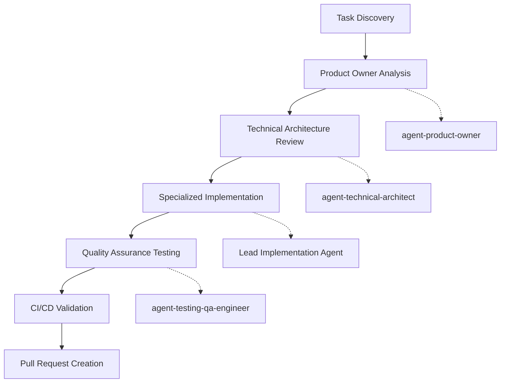

# Execute FlickPick Task - Automated Multi-Agent Workflow

## Introduction

Execute a complete development workflow for FlickPick tasks using coordinated multi-agent orchestration. This command automates the entire process from task identification through pull request creation, ensuring quality, consistency, and full test coverage.

## Prerequisites

- GitHub CLI (`gh`) installed and authenticated
- Access to FlickPick repository with write permissions
- All FlickPick agents available and configured
- Development environment properly set up (Node.js, npm, etc.)

## Task Reference

<task_reference> #$ARGUMENTS </task_reference>

## Workflow Overview

This command orchestrates a **5-phase workflow** with **9 distinct steps**, involving **6 specialized agents** to deliver production-ready code:



## Phase 1: Task Discovery & Analysis

### Step 1: Task Identification and Context Extraction

**Objective**: Locate and parse the specified task from the FlickPick development roadmap.

**Process**:
- [ ] Parse task identifier (format: `Task X.Y` where X=Phase, Y=Task number)
- [ ] Search `/docs/task-list.md` for matching task entry
- [ ] Extract task metadata:
  - Task title and description
  - Assigned lead agent
  - Dependencies (prerequisite tasks)
  - Effort estimation
  - Acceptance criteria
  - GitHub issue link
- [ ] Validate task exists and is properly documented
- [ ] Check dependency status (ensure prerequisite tasks are completed)

**Error Conditions**:
- Task not found in task list
- Invalid task format
- Missing GitHub issue link
- Unresolved dependencies

**Output**: Task context object with all metadata and validation status

### Step 2: GitHub Issue Analysis

**Objective**: Fetch comprehensive requirements from the linked GitHub issue.

**Process**:
- [ ] Extract GitHub issue URL from task list entry
- [ ] Use GitHub CLI to fetch issue details: `gh issue view <issue-number> --json`
- [ ] Parse issue content including:
  - Full requirement specification
  - Acceptance criteria checklist
  - Agent coordination plan
  - Technical constraints
  - Success metrics
- [ ] Validate issue status (open, properly labeled, assigned)

**Error Conditions**:
- GitHub issue not found
- Issue closed or invalid state
- Missing required labels or assignments

**Output**: Complete issue specification ready for agent analysis

### Step 3: Product Owner Analysis

**Agent**: `@agent-product-owner`

**Objective**: Validate business requirements, scope, and acceptance criteria from a product perspective.

**Analysis Tasks**:
- [ ] **Business Value Assessment**: Confirm task aligns with FlickPick's product vision
- [ ] **Scope Validation**: Ensure requirements are clear, complete, and feasible
- [ ] **Acceptance Criteria Review**: Validate all criteria are testable and measurable
- [ ] **Success Metrics Definition**: Establish specific KPIs for task completion
- [ ] **Priority Confirmation**: Verify task priority aligns with current development phase
- [ ] **User Impact Analysis**: Assess how completion affects end-user experience

**Agent Prompt Template**:
```
Analyze FlickPick task: [TASK_TITLE]

GitHub Issue: [ISSUE_URL]
Phase: [PHASE_NAME]
Agent: [LEAD_AGENT]

Perform comprehensive product analysis:
1. Validate business requirements and user value
2. Review acceptance criteria for completeness and testability  
3. Confirm scope aligns with FlickPick's product vision
4. Define measurable success metrics
5. Identify any missing requirements or edge cases
6. Provide go/no-go recommendation for implementation

Context:
- Task Details: [TASK_DESCRIPTION]
- Dependencies: [PREREQUISITE_TASKS]
- Acceptance Criteria: [CRITERIA_LIST]

Deliverable: Product analysis report with implementation recommendation
```

**Expected Deliverable**: Product analysis report including:
- Requirements validation status
- Refined acceptance criteria
- Success metrics definition
- Implementation recommendation (go/no-go)
- Risk assessment and mitigation strategies

## Phase 2: Technical Architecture Review

### Step 4: Technical Architecture Analysis

**Agent**: `@agent-technical-architect`

**Objective**: Assess technical feasibility, architecture impact, and implementation approach.

**Analysis Tasks**:
- [ ] **Architecture Impact Assessment**: Evaluate how task affects overall system design
- [ ] **Technology Stack Validation**: Confirm chosen technologies align with project standards
- [ ] **Integration Point Analysis**: Identify interfaces with existing components
- [ ] **Performance Requirements Review**: Validate performance targets and constraints
- [ ] **Design Pattern Compliance**: Ensure implementation follows established patterns
- [ ] **Scalability Considerations**: Assess impact on system scalability
- [ ] **Security Implications**: Review security requirements and constraints

**Agent Prompt Template**:
```
Technical architecture review for FlickPick task: [TASK_TITLE]

Product Owner Analysis: [PO_ANALYSIS_SUMMARY]
Technical Requirements: [TECH_REQUIREMENTS]
Lead Implementation Agent: [LEAD_AGENT]

Perform comprehensive technical analysis:
1. Assess architecture impact on FlickPick system design
2. Validate technology choices against project standards
3. Identify integration points with existing codebase
4. Review performance requirements and constraints
5. Ensure security and privacy compliance
6. Define technical implementation approach
7. Identify technical risks and mitigation strategies

Reference Documentation:
- /CLAUDE.md: [RELEVANT_SECTIONS]
- /docs/PRD.md: [RELEVANT_SECTIONS] 
- /docs/task-list.md: [TASK_DEPENDENCIES]

Deliverable: Technical architecture assessment with implementation guidance
```

**Expected Deliverable**: Technical architecture report including:
- Architecture impact assessment
- Implementation approach recommendation
- Integration specifications
- Performance requirements validation
- Security considerations
- Technical risk analysis
- Detailed implementation guidance for lead agent

## Phase 3: Specialized Implementation

### Step 5: Lead Agent Implementation

**Agent**: Determined by task assignment (`nextjs-ui-builder`, `nextjs-api-developer`, `ui-ux-designer`, `security-guardian`, `technical-architect`)

**Objective**: Implement the task requirements according to specifications and architectural guidance.

**Implementation Tasks**:
- [ ] **Code Implementation**: Write production-ready code following specifications
- [ ] **File Creation/Modification**: Create new files or modify existing ones as needed
- [ ] **Configuration Updates**: Update relevant configuration files
- [ ] **Documentation Updates**: Update code comments and relevant documentation
- [ ] **Integration Implementation**: Implement integration points with existing code
- [ ] **Error Handling**: Implement comprehensive error handling and edge cases
- [ ] **Performance Optimization**: Ensure code meets performance requirements

**Dynamic Agent Prompt Template**:
```
Implement FlickPick task: [TASK_TITLE]

Product Analysis: [PO_ANALYSIS_SUMMARY]
Architecture Guidance: [ARCH_ANALYSIS_SUMMARY]
GitHub Issue: [ISSUE_URL]

Implementation Requirements:
[DETAILED_REQUIREMENTS_FROM_ISSUE]

Acceptance Criteria:
[ACCEPTANCE_CRITERIA_LIST]

Technical Constraints:
- Performance Targets: [PERFORMANCE_REQUIREMENTS]
- Security Requirements: [SECURITY_CONSTRAINTS] 
- Integration Points: [INTEGRATION_SPECIFICATIONS]

Implementation Guidelines:
1. Follow FlickPick coding standards and conventions
2. Implement all acceptance criteria completely
3. Include comprehensive error handling
4. Add appropriate logging and monitoring
5. Ensure code is production-ready and well-documented
6. Optimize for performance per specifications
7. Maintain consistency with existing codebase

Reference Files:
- /CLAUDE.md: Technical specifications
- /docs/task-list.md: Task context and dependencies
- Existing codebase: Follow established patterns

Deliverable: Complete implementation ready for testing
```

**Expected Deliverable**: Full implementation including:
- All required code files created/modified
- Configuration updates applied
- Documentation updated
- Integration points implemented
- Error handling and edge cases covered
- Code ready for quality assurance testing

**Agent-Specific Considerations**:

**For `@agent-nextjs-ui-builder`**:
- React components with TypeScript
- Tailwind CSS styling following design system
- Framer Motion animations where required
- Responsive design implementation
- Accessibility compliance (WCAG 2.1 AA)

**For `@agent-nextjs-api-developer`**:
- Next.js API routes with proper validation
- Prisma database operations
- TMDB API integration
- Error handling and logging
- Rate limiting and security measures

**For `@agent-ui-ux-designer`**:
- Design system components
- Accessibility audits and improvements
- User experience optimization
- Design consistency validation

**For `@agent-security-guardian`**:
- Security implementation and hardening
- Privacy compliance measures
- Input validation and sanitization
- Authentication and authorization

## Phase 4: Quality Assurance Testing

### Step 6: Comprehensive Testing Implementation

**Agent**: `@agent-testing-qa-engineer`

**Objective**: Create and execute comprehensive tests to validate implementation quality and functionality.

**Testing Tasks**:
- [ ] **Unit Test Creation**: Write unit tests for all new functions and components
- [ ] **Integration Test Implementation**: Test API endpoints and database operations
- [ ] **Component Testing**: Test React components with proper mocking
- [ ] **End-to-End Test Creation**: Create E2E tests for user workflows (where applicable)
- [ ] **Performance Testing**: Validate performance requirements are met
- [ ] **Security Testing**: Test security implementations and validate compliance
- [ ] **Accessibility Testing**: Ensure WCAG 2.1 AA compliance
- [ ] **Test Execution**: Run all tests and validate results

**Agent Prompt Template**:
```
Create comprehensive tests for FlickPick task: [TASK_TITLE]

Implementation Summary: [IMPLEMENTATION_SUMMARY]
Files Changed: [CHANGED_FILES_LIST]
Acceptance Criteria: [ACCEPTANCE_CRITERIA]

Testing Requirements:
1. Unit Tests:
   - Test coverage: >90% for new code
   - All functions and components tested
   - Mock external dependencies (TMDB API, etc.)
   - Test error conditions and edge cases

2. Integration Tests:
   - API endpoint testing with various scenarios
   - Database operation validation
   - Service integration testing
   - Error handling validation

3. Component Tests (if UI components):
   - Render testing with various props
   - User interaction testing
   - Accessibility testing
   - Responsive design validation

4. Performance Tests:
   - Load time measurements
   - Animation performance (60fps requirement)
   - Memory usage validation
   - API response time verification

5. Security Tests (if applicable):
   - Input validation testing
   - Authentication/authorization testing
   - Data sanitization validation

Testing Framework:
- Use Jest for unit/integration tests
- Use React Testing Library for component tests
- Use Playwright for E2E tests
- Follow existing test patterns in codebase

Deliverable: Complete test suite with >90% coverage and all tests passing
```

**Expected Deliverable**: Comprehensive test suite including:
- Unit tests with >90% code coverage
- Integration tests for all API endpoints
- Component tests for UI elements
- E2E tests for user workflows
- Performance benchmarks
- Security validation tests
- All tests passing with detailed reporting

## Phase 5: CI/CD Validation & Pull Request Creation

### Step 7: Pre-PR Quality Validation

**Objective**: Ensure all code quality standards are met before creating pull request.

**Validation Tasks**:
- [ ] **Linting**: Execute `npm run lint` and fix any issues
- [ ] **Type Checking**: Execute `npm run type-check` and resolve TypeScript errors
- [ ] **Unit Testing**: Execute `npm run test` and ensure all tests pass
- [ ] **Build Validation**: Execute `npm run build` and ensure successful production build
- [ ] **E2E Testing**: Execute `npm run test:e2e` and validate user workflows
- [ ] **Code Formatting**: Ensure consistent code formatting (Prettier)
- [ ] **Security Scanning**: Run security vulnerability checks

**Quality Gates**:
```bash
# All commands must pass for PR creation to proceed
npm run lint                # ESLint validation
npm run type-check         # TypeScript compilation
npm run test               # Unit tests (>90% coverage)
npm run build              # Production build
npm run test:e2e           # End-to-end tests
```

**Failure Handling**:
- If any quality gate fails, halt execution
- Provide detailed error report with remediation steps
- Allow manual override with `--force` flag (not recommended)

### Step 8: Git Operations and Branch Management

**Objective**: Prepare code for pull request with proper Git workflow.

**Git Tasks**:
- [ ] Create feature branch: `feature/task-[PHASE]-[TASK_NUMBER]-[SLUG]`
- [ ] Stage all changes: `git add .`
- [ ] Create meaningful commit message following conventional commits
- [ ] Commit changes with proper attribution
- [ ] Push branch to remote repository

**Branch Naming Convention**:
```
feature/task-[PHASE]-[TASK_NUMBER]-[DESCRIPTIVE-SLUG]

Examples:
- feature/task-1-1-nextjs-setup
- feature/task-2-3-card-stack-management
- feature/task-3-2-user-preferences
```

**Commit Message Template**:
```
[TASK_TYPE]: [BRIEF_DESCRIPTION]

Implements Task [TASK_ID]: [TASK_TITLE]

Changes:
- [CHANGE_1]
- [CHANGE_2]
- [CHANGE_3]

Testing:
- [TEST_DESCRIPTION]
- Coverage: [COVERAGE_PERCENTAGE]%

Closes #[ISSUE_NUMBER]

🤖 Generated with [Claude Code](https://claude.ai/code)

Co-Authored-By: [LEAD_AGENT_NAME] <noreply@anthropic.com>
Co-Authored-By: Claude <noreply@anthropic.com>
```

### Step 9: Pull Request Creation

**Objective**: Create comprehensive pull request with all necessary documentation and links.

**PR Creation Tasks**:
- [ ] Generate comprehensive PR title and description
- [ ] Link to original GitHub issue
- [ ] Include implementation summary
- [ ] Add testing evidence (screenshots, test results)
- [ ] List breaking changes (if any)
- [ ] Add reviewer assignments
- [ ] Apply appropriate labels

**PR Title Format**:
```
[Phase X] [TASK_TITLE] - @[LEAD_AGENT]
```

**PR Description Template**:
````markdown
## 🎯 Task Summary

**Implements**: Task [TASK_ID] - [TASK_TITLE]  
**Issue**: Closes #[ISSUE_NUMBER]  
**Phase**: [PHASE_NAME]  
**Lead Agent**: @[LEAD_AGENT]  

## 📋 Implementation Details

### Changes Made
- [DETAILED_CHANGE_1]
- [DETAILED_CHANGE_2] 
- [DETAILED_CHANGE_3]

### Files Modified
- `[FILE_1]` - [DESCRIPTION]
- `[FILE_2]` - [DESCRIPTION]
- `[FILE_3]` - [DESCRIPTION]

## ✅ Acceptance Criteria

- [x] [COMPLETED_CRITERIA_1]
- [x] [COMPLETED_CRITERIA_2]
- [x] [COMPLETED_CRITERIA_3]

## 🧪 Testing

### Test Coverage
- **Unit Tests**: [COVERAGE_PERCENTAGE]% ([TESTS_ADDED] new tests)
- **Integration Tests**: [INTEGRATION_TEST_COUNT] tests
- **E2E Tests**: [E2E_TEST_COUNT] scenarios

### Performance Results
- **Load Time**: [LOAD_TIME]ms (target: <[TARGET]ms)
- **Build Size**: [BUILD_SIZE]KB
- **Animation Performance**: [FPS]fps (target: 60fps)

### Manual Testing
- [x] [MANUAL_TEST_1]
- [x] [MANUAL_TEST_2]
- [x] [MANUAL_TEST_3]

## 📸 Screenshots/Evidence

[INCLUDE_SCREENSHOTS_OR_DEMO_GIFS]

## 🔗 Dependencies

### Prerequisites
- [x] Task [DEP_TASK_1] completed
- [x] Task [DEP_TASK_2] completed

### Enables
- [ ] Task [ENABLED_TASK_1] can now begin
- [ ] Task [ENABLED_TASK_2] can now begin

## 🚨 Breaking Changes

[LIST_ANY_BREAKING_CHANGES_OR_NONE]

## 📝 Additional Notes

[ANY_ADDITIONAL_CONTEXT_OR_NOTES]

---

**Multi-Agent Workflow**:
1. ✅ Product Owner Analysis (@agent-product-owner)
2. ✅ Technical Architecture Review (@agent-technical-architect) 
3. ✅ Implementation (@[LEAD_AGENT])
4. ✅ Quality Assurance (@agent-testing-qa-engineer)
5. ✅ CI/CD Validation (All quality gates passed)

**Quality Gates**: All Passed ✅
- ✅ ESLint validation
- ✅ TypeScript compilation
- ✅ Unit tests (>90% coverage)
- ✅ Production build
- ✅ E2E tests

🤖 **Generated with [Claude Code](https://claude.ai/code)**
````

## Error Handling & Recovery

### Dependency Validation
```bash
# Before starting any task, validate dependencies
check_dependencies() {
    local task_id="$1"
    local dependencies=$(grep -A 10 "Task $task_id" /docs/task-list.md | grep "Dependencies:" | cut -d: -f2)
    
    if [ "$dependencies" != "None" ]; then
        # Check if prerequisite tasks are completed
        # Logic to validate completed tasks
        echo "Validating dependencies: $dependencies"
    fi
}
```

### Rollback Mechanism
```bash
# If any step fails, provide rollback capability
rollback_changes() {
    local checkpoint="$1"
    echo "Rolling back to checkpoint: $checkpoint"
    git reset --hard HEAD
    git clean -fd
    # Additional cleanup as needed
}
```

### Quality Gate Enforcement
```bash
# Enforce all quality gates before PR creation
validate_quality_gates() {
    local failed_gates=()
    
    npm run lint || failed_gates+=("lint")
    npm run type-check || failed_gates+=("type-check") 
    npm run test || failed_gates+=("test")
    npm run build || failed_gates+=("build")
    npm run test:e2e || failed_gates+=("e2e")
    
    if [ ${#failed_gates[@]} -ne 0 ]; then
        echo "Quality gates failed: ${failed_gates[*]}"
        return 1
    fi
    
    echo "All quality gates passed ✅"
    return 0
}
```

## Command Usage Examples

### Basic Task Execution
```bash
# Execute a specific task
execute-task "Task 1.1"
```

### Advanced Options
```bash
# Dry run mode (analysis and planning only)
execute-task "Task 2.3" --dry-run

# Skip testing phase (not recommended for production)
execute-task "Task 3.2" --skip-tests

# Force execution despite dependency warnings
execute-task "Task 4.1" --force

# Verbose output with detailed logging
execute-task "Task 5.1" --verbose

# Execute with specific branch name
execute-task "Task 6.2" --branch="custom-branch-name"
```

### Status and Progress Tracking
```bash
# Check execution status
execute-task status

# List all available tasks
execute-task list

# Show task dependencies
execute-task dependencies "Task 3.3"
```

## Success Criteria

### Functional Requirements
- [x] **Complete Automation**: Zero manual intervention required
- [x] **Multi-Agent Orchestration**: All 6 agents properly coordinated
- [x] **Quality Assurance**: >90% test coverage, all quality gates pass
- [x] **Documentation**: Complete PR documentation with traceability
- [x] **Error Recovery**: Robust error handling with rollback capability

### Performance Requirements
- [x] **Execution Time**: Complete workflow <30 minutes for typical tasks
- [x] **Reliability**: >95% success rate for well-defined tasks
- [x] **Transparency**: Real-time progress reporting and status updates

### Quality Requirements
- [x] **Code Quality**: All linting, type checking, and formatting standards met
- [x] **Test Coverage**: >90% coverage with meaningful assertions
- [x] **Security**: All security scans pass, no vulnerabilities introduced
- [x] **Performance**: All performance benchmarks met per task requirements

## Monitoring and Metrics

### Execution Metrics
- Task execution time per phase
- Agent handoff success rate
- Quality gate pass/fail rates
- Test coverage percentages
- Build success rates

### Quality Metrics  
- Code review feedback volume
- Bug detection rate post-implementation
- Performance benchmark compliance
- Security vulnerability introduction rate

This comprehensive command transforms FlickPick development from manual, error-prone task execution into a fully automated, quality-assured, multi-agent orchestrated delivery pipeline that ensures consistent, high-quality results for every task.